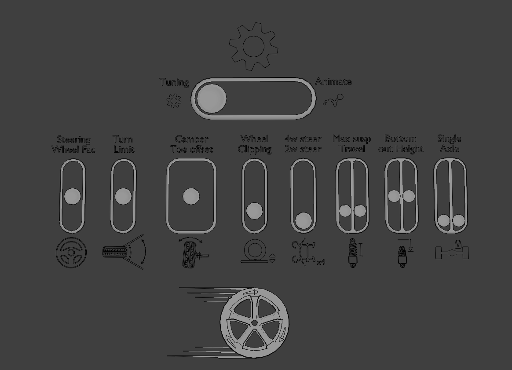

Viewport Controls
===================================

.. _setup_handles:
Setup Sliders
------

The Setup Sliders are used to control features of the rig and the intensity of them.
Go into "Pose-Mode", Select the top "Switch Handle" and move it toward the Gear Icon to show the Setup Sliders.

    
    *Setup Sliders shown in the 3D View above the vehicle* 

Steering Wheel Factor
  LC automatically turns the steering wheel bone inside the vehicle (see more here :ref:`garage-mode`). Use the Steering Wheel Factor slider to determine how much the steering wheels should rotate based on the steering of the car.

Turn Limit
  Determines the maximum turning angle of the front wheels. Default is 45deg. When drifting or steering normally, the front wheels will "lock" when they reach the turn limit.

.. note::
    The maximum turn that can be locked is 135 degs of turn. Anything above that, will not be locked correctly. Consider using :ref:`simple-steering` to avoid this problem.

Camber and Toe
  Changes the camber angle of the wheels (up/down) and the toe angle of the wheels (left/right).

Wheel Clipping
    To add realism to car animations the wheels need to be pushed slightly through the floor plane and the body of the car dropped slightly. This simulates the weight of the car pushing it down. The slider adjusts the intensity of this effect.

Wheel Count
    Pick either 2 wheel steering or 4 wheel steering (2 wheel steering has the best support).
    4 wheel steering does not work with the "Turn Limit".

Max Suspension Travel
  Changes the length of the spring. Determines how low the wheels are hanging, when the car is airbourne, or lifted.

Bottom-out Height (Suspension Clamp)
     Alters the height at which the spring will be fully compressed, making the wheels and the body unable to come closer to each other. "Clipping Warning Icons" will appear at the wheels of the vehicle when the spring is fully compressed.

Single Front/Rear Axle
  Turn the front/rear axle into a "solid" single axle. Also called "live axle". This is seen on some offroad cars. 

Ackermann Accuracy (Only visible with Expanded UI)
   Adjust the accuracy of the Ackermann calculation in the rig. The more accurate, the more 'wobble'/'flicker' would be visible in the steering during smooth turns. 

|
.. _animation_handles:
Animation Controls
------

The Animation handles and sliders are made to be animated. Go into "Pose-Mode", Select a handle and hit "I"-> Location or Rotation to add a keyframe to it.

|
Handles:
^^^^^^^^
Animation Handles are used to control the animation of the vehicle.

    
    *Animation Handles shown in the 3D View around the vehicle* 

Movement Handle (Wheel Icon)
    Is used to offset the vehicle along the Driving Path. Rotating the wheel clockwise will make the vehicle move. See :ref:`user-animation` for more details.

Mass Handle (Axis Icon)
    Controls the visual weight of the vehicle - Up/Down, Front/Back and Left/Right. This can also be calculated automatically using the :ref:`real-time-physics` or added on top of it.

Drift Handle (Curved Arrow Icon)
    Controls the amount the tail of the vehicle is swinging/drifting. The Drift will pivot around the front axle of the vehicle. Can be combined with the :ref:`drift-offset` handle for more control.

|
Sliders:
^^^^^^^^
The Animation Sliders are used to control features of the rig which can be animated throughout the time of the animation.

    
    *Animation Sliders shown in the 3D View above the vehicle* 

Wheel Shake
    Adds slight random wheel shake to all the wheels making the road feel rugged.

Wheel Wobble
    Adds slight random wheel wobble to all the wheels making the car feel old or worn.

Camber Amount
    Controls the intensity of the Camber/Caster effect.

Airbourne Mode
    Allows the car to be airbourne. As the rig is usually sticking the car to the ground at any time using the ground detection, the Airbourne switch is used to disable this temporarily while the car should be in the air during a jump. Animate the value from 0 to 1 or 1 to 0 over 2-5 frames for the best result. Too fast transitions makes the animation "snap or pop".

|
.. _extra_animation_handles:
Expanded UI
------

Extra Animation Handles are visible when "Expanded UI" is selected in in the View settings. The handles can be revealed giving the user more flexibility when animating. Inside the Manual Gearbox, the :ref:`enable_extra_handles` can be enabled.

|
Handles:
^^^^^^^^
..  figure:: img/IMG_ExtraAnimationHandles02.jpg
    :alt: Extra Handles
    :class: with-shadow
    :width: 600px
    :align: center
    
    *Extra Animation Handles shown in the 3D View around the vehicle* 

.. _wheel-turn:
Wheel Turn (Pair)
    Pull it side-to-side to turn the wheels in pairs. This is added on top of the automatically calculated steering.

Wheel Turn (Individual)
    Rotate to turn each wheel individually. This is added on top of the automatically calculated steering.

.. _wheel-spin:
Wheel Spin
    Make the wheels spin by adding extra rotation to the handle or make the wheel lock-up by counter-rotating it. Individual control for each wheel. 

.. _wheel-z-offset:
Wheel Z-Offset
    Pull up/down to add manual wheel z-offset. This is added on top of the automatic suspension.

.. _camber-toe-offset:
Camber and Toe Offset
    Per wheel adjustment of Camber and Toe by rotating the handles.

.. _suspension:
Suspension Offset
    Per shock offset of the suspension to lift or lower the body of the vehicle.

.. _drift-offset:
Drift Offset
    This Handle is used to make drift animations more realistic, by offsetting the visual weight of the vehicle to the left or right relative to the path. When drifting, the vehicle will rotate around the front axle, which in some cases will look correct, but it often improves the realism to offset the "drift offset" Handle slightly during the ending of the drift. Take a look at the gif below to see how the drift offset makes the end of the drift feel more realistic by slightly offseting the car as the drift ends.

    
    *Example of using the Drift Offset Handle* 

|
Sliders:
^^^^^^^^

    
    *Extra Animation Sliders shown in the 3D View above the vehicle* 

.. _auto-drift-roll:
Auto Drift Roll
    The amount of influence car drift has on the roll of the body. The bigger the drift amount, the mode the body roll.

.. _simple-steering:
Simple Steering
     If the automatic Ackermann steering does not perform well in certain frames or animations, a traditional track-to-bone steering can be used either for the full shot or for a small part of it by animating the slider.

.. _airbourne-const-rot:
Airbourne ConstrainRot
    When the car is airbourne, its rotation will still be determined by the tangent of the animation curve, which does not always look correct when the car is doing a jump. The "Airbourne ConstrainRot" forces the car to stay horizontal when airbourne. The slider is meant to be animated during the airbourne time usually going from 0 towards 1 with the maximum value when the car lands on the ground.

.. _pivot-pos:
Pivot Offset
    Since steering geometry is calculated from the rear axle of a car, the pivot of the rig is on top of the rear axle of the car. For some specific animations, it is preferable to shift the pivot to the front axle to make it easier to animate. For instance when animating "donuts" or tight drifts. You can also animate the slider slowly to offset the pivot mid-animation. Changing this slider WILL make the steering inaccurate, can be used in combination with :ref:`simple-steering`

    
    *Offsetting the rig pivot to achive tight drift and donuts. Left: Rear Axle Pivot, Right: Front Axle Pivot.* 

