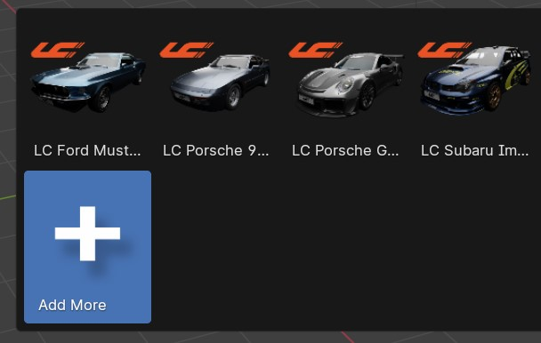
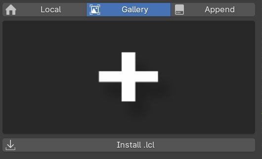

Launch Control Asset Packs
############

Vehicle Asset Packs
^^^^^^^^^^

Launch Control comes with a vehicle included that is ready to be rigged. 
If you want to expand the library, you can download more Launch Control Vehicle Packs and install them directly from the interface.

How to install a Vehicle Pack
===========

Using the .lcl file, a Vehicle Pack can be installed directly from the LC interface.
Just open the gallery and locate the "+" icon.

|

Then Click the "Install .lcl" button and locate the pack on your harddrive.

The installation process might take up to few minutes depending on the size of the vehicle pack.

|

Download Vehicle Packs
===========

.. list-table::
   :width: 100%
   :class: borderless

   * - .. image:: img/LC_Vehicles_01.webp
          :width: 100%
          :target: http://dl.dropboxusercontent.com/scl/fi/3brm5smwb0tes7n5gat0p/LC_Vehicles_01.lcl?rlkey=cp55lz7ts78ett5q7ozkfto5e&dl=0

     - .. image:: img/TMF_Vehicles_01.webp
          :width: 100%
          :target: http://dl.dropboxusercontent.com/scl/fi/6h1hj64t2vgf5uanp61j2/TMF_Vehicles_01.lcl?rlkey=qqmmwuspjbnombzs37zzrei4v&dl=0

   * - 5 Launch Control models ready to rig.
     - 4 models Sponsored by The Mega Fleet.
     
