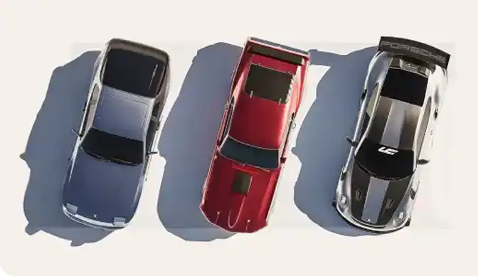
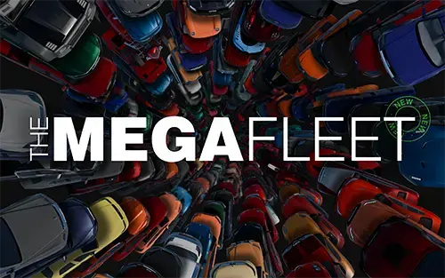

Launch Control Asset Packs
############

Vehicle Asset Packs
^^^^^^^^^^

Launch Control comes with a few vehicles included that are all ready to be rigged. 
If you want to expand the library, you can download more Launch Control Vehicle Packs and install them directly from the interface.

How to install a Vehicle Pack
===========

Using the .lcl file, a Vehicle Pack can be installed directly from the LC interface.
Just open the gallery and locate the "+" icon.

.. image:: img/VEHICLE_PACK_PLUS.jpg
    :alt: Add Vehicles
    :class: with-shadow
    :width: 300px
    :align: center
|

Then Click the "Install .lcl" button and locate the pack on your harddrive.

The installation process might take up to few minutes depending on the size of the vehicle pack.

.. image:: img/VEHICLE_PACK_INSTALL.jpg
    :alt: Asset Pack installation
    :class: with-shadow
    :width: 300px
    :align: center
    :target: http://cnn.com
|

Download Vehicle Packs
===========

|pic1| |pic2|
