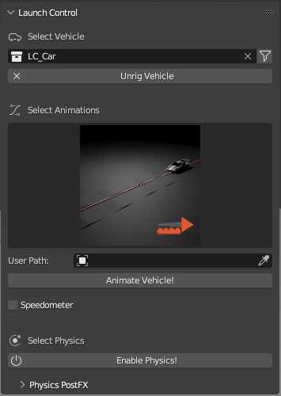
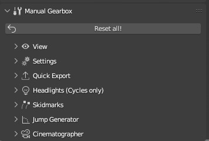
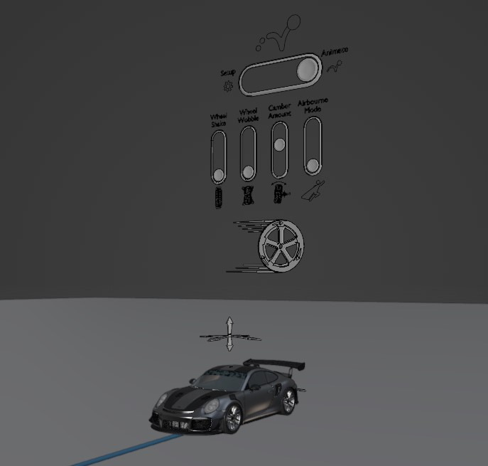
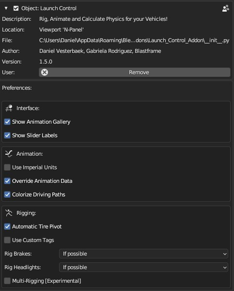

Animating Cars should be Fun! 
===================================

Launch Control (LC) is an Animation Tool for Blender built to solve the problems 
we face when rigging and animating 4-wheeled cars.

The rig generated by LC is fully supported in vanilla Blender. The add-on Interface speeds up your workflow by giving you presets and automated functions.

The Interface is split into two sections making it both easy to use and fully customizable

.. raw:: html

    

        <iframe src="https://www.youtube.com/embed/7IMdpqP5TEc" frameborder="0" allowfullscreen style="position: absolute; top: 0; left: 0; width: 100%; height: 100%;"></iframe>
    

|

Launch Control Core
---------

Dive straight in. Rig your Vehicle with :ref:`rigging`, Animate using :ref:`animation-presets` or :ref:`user-path`, and enable :ref:`real-time-physics`.
What you see is what you get - No baking, waiting, or guessing is required here.
Use the :ref:`postfx` to fine-tune the look of the physics.

    *Launch Control Core Interface*    

Manual Gearbox
--------

Go deeper. Discover the expanded features that LC offers.
Set up Realistic :ref:`headlight-beams`, generate :ref:`skidmarks` automatically, set up tracking and following :ref:`cameras`, calculate :ref:`jump-trajectories`, and use :ref:`qucik-export` to Unreal Engine or any other DCC using One Click.

Here you can also reveal more Animation Handles in the rig, direct the way the :ref:`ground-detection` works, and much more.

    *Manual Gearbox Interface*    

Viewport Handles
-------

Outside the Add-in Interface, you will find interactive handles to control the animation of your vehicle. You can adjust or animate everything all the way down to the Camber/Toe for each wheel. - Or you can leave all this op to Launch Control if you prefer.

The floating UI keeps track of adjustments to the rig of the car. Here you can adjust the maximum steering angle, suspension length, shock "bottom-out" distance, and even adjust the rig to use a "single rear axle" or 4-wheel steering if you so desire.

    *Viewport Handles shown above vehicle*

User Preferences
--------

Inside the Add-on Preferences, you can adjust global settings that will be saved across all your Blend files. Here you can alter the way LC behaves during rigging, animation, and how the Interface is shown.

    *User Preference Menu for LC*

Help!
--------

If you are looking for tutorials, check out the growing Launch Control Tutorial Playlist on YouTube!
https://youtu.be/7IMdpqP5TEc?list=PLU1g4xp6lcpj-X3ZWywgsxZJYtiVwNQpW

Meet up with us on the official Discord Server! 
https://discord.gg/4styJSUNW9

Contents
--------
 
.. toctree::

   launch-control-core
   manual-gearbox
   animation-handles
   user-preferences
   
