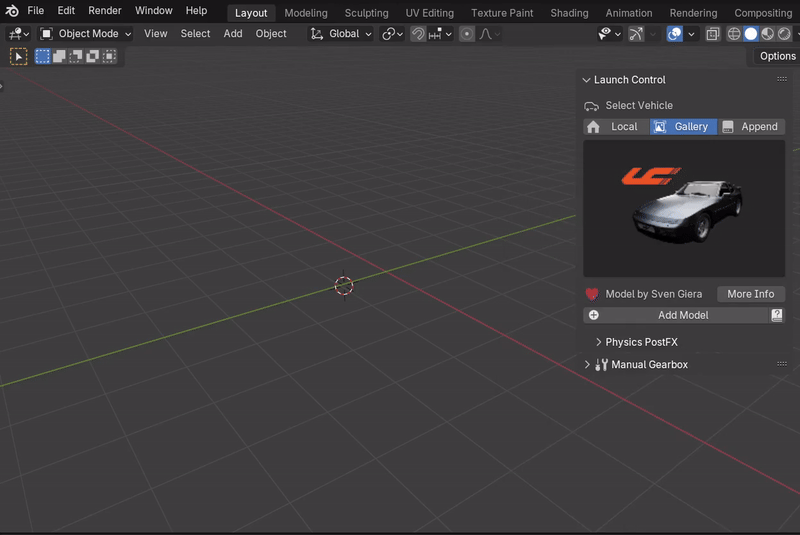

Installing
############

.. image:: gif/GIF_Install_extensions.gif
    :alt: Installation Gif
    :class: with-shadow
    :width: 800px
    :align: center
|

Step 1: Inside Blender head to "Edit -> Preferences -> Get Extensions -> Install from Disk..."

Step 2: Locate the downloaded .zip and click "Install from Disk"

(Step 3:) Optionally, go to "Add-ons" and search for "Launch Control" to alter the add-on preferences

|
|

Uninstalling/Updating
^^^^^^^^^^

|

Step 1: Inside Blender head to "Edit -> Preferences -> Get Extensions".

Step 2: Locate "Launch Control" and click the down-arrow to the right of the extension name.

Step 3: Click "Uninstall" and restart Blender to clear all the data from Launch Control.

(Step 4): Install the new desired version as described above.
