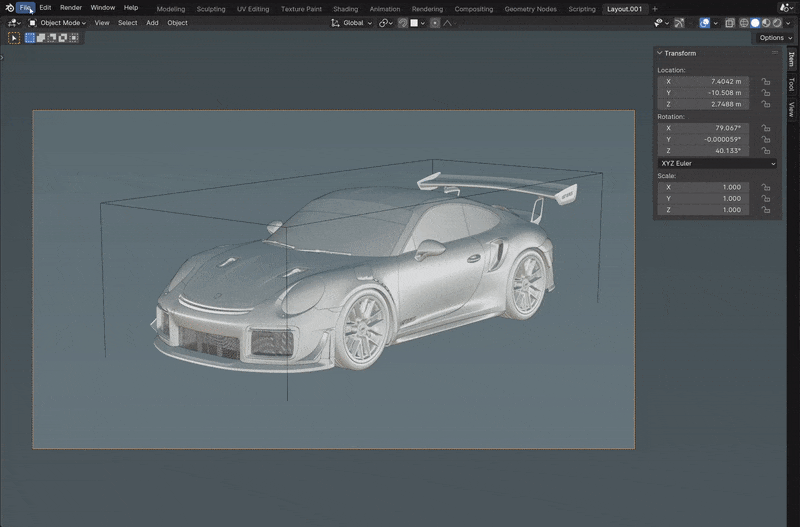
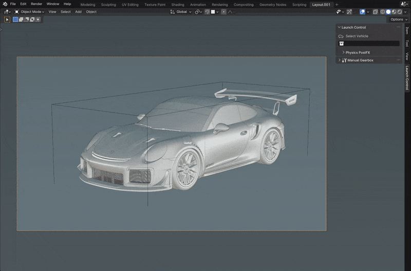

Installing
############

|

Step 1: Inside Blender head to "Edit -> Preferences -> Add-ons -> Install..."

Step 2: Locate the downloaded .zip and click "Install Add-on"!

|
|

Uninstalling/Updating
^^^^^^^^^^

|

Step 1: Inside Blender head to "Edit -> Preferences -> Add-ons".

Step 2: Search for "Launch Control" and expand the field called "Object: Launch Control".

Step 3: Click "Remove" and restart Blender to clear all the data from Launch Control.

(Step 4): Install the new desired version as described above.
