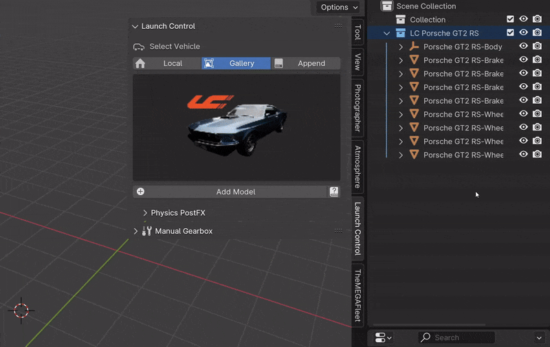

Launch Control Core
===================================
The Main Features part is split into 3 segments: "Rigging, Animation, and Physics".
Let's go over each of those here.

.. _rigging:
One-Click Rigging
------
LC uses :ref:`rigging-tags` to detect the parts of the vehicle. If the naming convention of the 3D model is supported by LC, the rigging can be done with one click. 

:ref:`quick-tag-tool` can be used to prepare unsupported 3D models to work with LC with a few clicks.

:ref:`custom-tags` can be used to optimize LC for your own naming convention.

.. _vehicle-collection:
Vehicle Collection
^^^^^^^^^^

The Vehicle Collection field allows a multi-car workflow in LC and keeps track of the Active Car.

Select a Collection, which holds the vehicle you want to rig by dragging the collection from the outliner into the field or by browsing the available options by clicking the field

    
    *Selecting a Vehicle Collection* 

.. _rigging-tags:
Rigging Tags
^^^^^^^^^^

If all required car parts are found, LC can rig the car.

Required car parts:
    * *Car Body*
    * *Front Right Wheel*
    * *Front Left Wheel*
    * *Rear Right Wheel*
    * *Rear Left Wheel*

If any of the optional car parts are found they will be rigged - If not, they will be ignored. This behavior can be changed inside "User Preferences -> :ref:`rigging-preferences`"

Optional car parts:
    * *Front Right Brake Caliper*
    * *Front Left Brake Caliper*
    * *Rear Right Brake Caliper*
    * *Rear Left Brake Caliper*
    * *Right Headlight*
    * *Left Headlight*

Multiple tags are being searched for when LC is detecting the objects. The full list for each object/location is:

    * *Wheels:   ["Tire", "Wheel", "Wheels", "Tires", "Rad", "Räder", "Tyre", "Tyres"]*
    * *Body:   ["Body", "Hull"]*
   |

    * *Brake:   ["Brake","Brakes", "Calliper", "Caliper", "Callipers", "Calipers", "Bremse"]*
    * *Headlight:   *["Headlight", "Headlamp", "Headbulb", "Front_light", "Front_lamp", "Front_bulb", "Front_emitter"]*
   |

    * *Rear, Left:   *["RL", "BL", "RearLeft", "BkL", "Bk.L", "Bk_L"]*
    * *Rear, Right:   *[RR", "BR", "RearRight", "BkR", "Bk.R", "Bk_R"]*
    * *Front, Right:   *["FR", "FrontRight", "FtR", "Ft.R", "Ft_R"]*
    * *Front, Left:   *["FL", "FrontLeft", "FtL", "Ft.L", "Ft_L"]*

.. note::
   All Tags are case-insensitive.

.. _quick-tag-tool:
Quick-Tag Tool
^^^^^^^^^^
You can quickly tag Car Parts that needs renaming to be compatible with LC using the Quick-Tag Tool. Select a Car Part (for instance the Car Body) in the viewport, and hit, "body", to tag the selected object as the body of your car. Do the same for wheels and the brake calipers and headlights if desired. 

"FL, FR, RL and RR" referes to the location of the car part and respectively means: "Front Left, Front Right, Rear Left and Rear Right".

..  figure:: img/IMG_QUICK_TAG_TOOL.jpg
    :alt: Quick-Tag Tool
    :class: with-shadow
    :width: 350px
    :align: center
    
    *The Quick-Tag Tool in the Interface* 

.. _native_lc_support:
Asset Packs for LC
^^^^^^^^^^
Many Vehicle models have supported naming conventions out of the box.
Some Asset Packs that are natively supported are:
    * `Car Transportation <https://blendermarket.com/products/transportation>`_
    * `Car Teleporter <https://blendermarket.com/products/car-teleporter>`_
    * `Traffiq Car <https://blendermarket.com/products/car-library-traffiq-vehicles-for-blender>`_

.. _troubleshoot_rigging:
Troubleshoot Rigging
^^^^^^^^^^

If any issues were found during rigging, LC will promt you with a message about which body part was missing.
The objects tagged as "Wheels" need to be the tire meshes of the vehicle. The objects tagged as "Body" and "Brakes" can be empties.

In some cases, the rigging is succesful, but inacurate, which can cause shaking or wobbly wheels.
This is usually due to one of 3 things:
    * The Rear or Front wheels are not properly alligned
    * Any of the wheels had a rotation offset or the geometry was not straightned before rigging
    * The Tire Mesh does not have evenly distributed geometry (See :ref:`force-pivot`)

Custom rigging and parenting can be done using the :ref:`rig-setup-mode`

.. _animation
Animation
------
LC uses a curve based animation workflow to give you full creative control over the movement. :ref:`user-animation` is acting on top of the automatically calculated animations, allowing the user full customization of the animation.

.. _animation-presets:
Animation Presets
^^^^^^
To quickly try out animations use the presets. Select a Preset from the Gallery and hit "Animate Vehicle".

.. _user-path:
User Path
^^^^^^
To use your own "Bezier Curve" or "Nurbs Path" to animate the car along, use the "User Path" field.
Click the field to browse for your desired path or drag-n-drop the path into the field. Hit "Animate Vehicle".

The Vehicle will automatically be animated to drive along the length of the path over the scene time. (See :ref:`auto-animate`)

.. note::
    If a "User Path" is selected, it will overrule/gray out the animation presets.

.. _update-driving-path:
Update Driving Path
^^^^^^
While adjusting the control points of the Driving Path, the total length of the path might change.
When this happens, LC will prompt you to "Update Driving Path" before adjusting any animation.
Click "Update Driving Path" in the LC interface. - This resolved any offsets to the animation due to the changed Driving Path.

.. _user-animation:
User Animation
^^^^^^
Much of the movement is calculated automatically by LC as the vehicle is following the path - This includes: Steering, Wheel Rotation, Suspension, Camber/Castor.
User Animation is what the user needs to animate to make the vehicle move like desired. Handles in the viewport are used to animate this.

..  figure:: img/IMG_UserAnim.png
    :alt: Speed Animation
    :class: with-shadow
    :width: 350px
    :align: center
    
    *Handles for User Animation* 

Go into "Pose Mode" to adjust any of the Handles.
After adjusting a Handle hit "I" on the keyboard and pick "Location" or "Rotation" depending on which Handle you are animating.

Movement Handle: Rotation
Mass Handle: Location
Drift Handle: Rotation

.. note::
    Animating the movement/speed of the Vehicle can easily be done with a Graph Editor open. The inclination of the animation curve at any point determines the speed at the given time.

    
    *The Inclination determines the Speed* 

.. _real-time-physics:
Real-Time Physics
------

Physics are used in LC to add secondary motion to the vehicle, which is tedious to animate by hand.
The Physics are layed on top of the Automatic and User Animation and are fully non-destructive to the User Animation.

Presets can be used to get different results, or use the :ref:`physics-customize` checkbox to adjust the Physics settings in detail.

.. note::
The Physics always has one of four states:
    * LIVE
    * BAKED
    * MUTED
    * OUTDATED

.. _live-physics:
Live Physics
^^^^^^

When the Physics are LIVE, they are simulated in real-time when Blender is playing forward.

..  image:: img/IMG_LivePhysics.jpg
    :alt: Enable Physics
    :class: with-shadow
    :width: 300px
    :align: center

.. note::
    Physics cannot be calculated LIVE when playing backward.
    LIVE Physics will cache when playing back. To ensure you are seeing the latest result, revert the timeline back to frame 0 or hit the 'Reset Physics'-button.

.. _baked-physics:
Baked Physics
^^^^^^

When the Physics are BAKED, changes to the animation will not affect the physics. The Physics are locked and are ready to be rendered.

..  image:: img/IMG_BakedPhysics.jpg
    :alt: Enable Physics
    :class: with-shadow
    :width: 300px
    :align: center

.. warning::
    Due to a bug in Blender, BAKED physics do not load correctly when re-opening the file. After reopening, you would need to bake the physics again.

.. _muted-physics:
Muted Physics
^^^^^^

When the Physics are MUTED, the baked physics motion is kept, but disabled temporarily. The vehicle will only have the motion from the animation. Hit the Unmute button to show the baked physics motion again.

.. _outdated-physics:
Outdated Physics
^^^^^^

When the Physics are OUTDATED, they have been baked, but changes in the scene or the physics settings have made the bake invalid or outdated. Please bake the physics again if this is the case.

.. _physics-customize:
Customize
^^^^^^

By checking to "Customize" box, a list of sliders will be revealed.
These sliders can be used to adjust the parameters used when simulating the physics. If the Physics are Baked, you would need to re-bake to see the result of the change. 

    
    *Physics can be customized in the Interface* 

Spring Hardness:
*The 'Tightness/Hardness' of the Spring. Increase this to have the Spring be harder and respond faster (Feeling of a light vehicle or road/track vehicle), decrease this to make the Spring respond slower and feel softer (Feeling of a heavy offroad vehicle).*

Spring Damping:
| 
*How quickly the spring stops moving after an impact. A low value makes the spring wobble for a long time after an impulse.*

Smoothing:
| 
*Adds extra smoothing to the ride. Makes the response slower and dampens more of the forces. Equivilant to Decreasing 'Hardness' and Increasing 'Dampening' at the same time.*

Simulate Gravity:
| 
*Let the physics take care of the Gravity when the vehicle is in the air. When 'ON' the vehicle might deviate more from the Driving Path during jumps. When 'OFF' the car will stick 'tightly' to the path, even if it would be physically impossible - This is useful for making the car do loops or running over a bumpy road in a controlled manner*

Auto Level:
|
*During airtime, the vehicle can start to nose-dive or pitch backwards. Using Auto Level, you can bias the physics toward keeping the vehicle level rather than pitching or rolling.*

Vehicle Mass:
| 
*Similar to 'Spring Hardness', affects how much the car is affected by impacts from the road. Increase this to make the bumps and landings have less impact on the body motion of the vehicle and vice-versa.*

Spring Offset:
| 
*Fine-tune the physics Suspension Height. This is only affecting the car when physics are turned on.*

.. warning::
    When set too high, the car will keep bouncing. 

.. _postfx:
PostFX
^^^^^^

To make it easier to art direct the Physics, use the PostFX to adjust the influence of the Physics on each Axis of Rotation and Location. PostFX can be animated as well.

Body Forces:
*Turns, sudden speed-changes and jumps have an impact on the "Body Forces"*

    * Pitch, Yaw, Roll:
        * *The physics influence on the body of the car in each of the 3 rotation axis.*

    * Up/Down: 
        * *The physics influence on the up/down movement of the body of the car.*
|
Wheel Forces:
*Impact when the wheels hit the ground because of a jump or a bump.*

    * Up/Down:
        * *How much an impact with the ground affects the wheels up/down movement.*
       
    * Tire Pressure:
        * *How much the tires are allowed to clip through the floor (To simulate low pressure inside the tires when they have a hard impact with the ground).*

