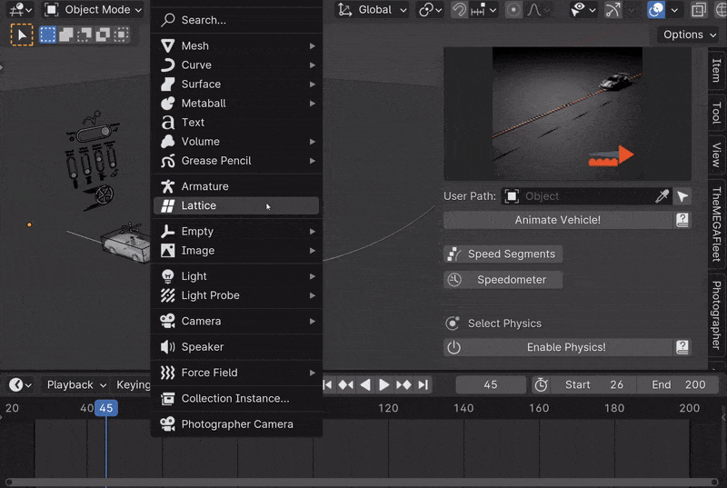
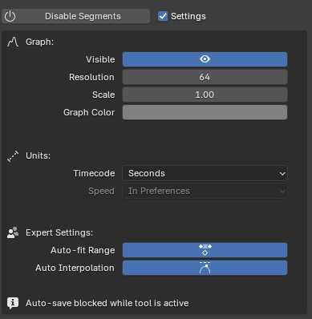
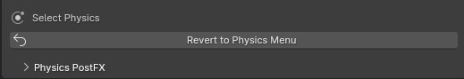

Launch Control Core
===================================
The Main Features part is split into 4 segments: ":ref:`vehicle-collection`, :ref:`rigging`, :ref:`animation`, and :ref:`real-time-physics`".

Let's go over each of those here.

|
.. _vehicle-collection:
Select Vehicle
------

To get started, select the vehicle you want to animate.

This can be done in 3 different ways with the menu at the top of the LC interface.

..  figure:: gif/DOC_Select_Car_GIF.gif
    :alt: Select Car GIF
    :class: with-shadow
    :width: 600px
    :align: center
    
    *Select a Vehicle to animate in 1 of the 3 different ways* 

|

After rigging the selected vehicle, more vehicles can be added by clicking the "+ icon" in the top, right corner. Alternatively, the Vehicle Collection Field can be cleared to bring back the Vehicle Selection menu.

.. note::
    The Vehicle Collection Field is also used for the :ref:`multi-car-workflow`. It keeps track of all rigged LC vehicles and you can at any time change the active LC vehicle from this field.

|

.. _local-vehicle:
Local Vehicle
^^^^^^^^^^

Local Vehicles are vehicles that exist inside the open file. To use one of these for rigging, make sure all the tagged car parts (see :ref:`rigging-tags`) are contained inside 1 collection.
Drag and drop that collection into the "Collection Field" and hit "Rig Vehicle".

.. _gallery-vehicle:
Gallery Vehicle
^^^^^^^^^^

Gallery Vehicles are vehicles that are included with Launch Control or are installed using an .lcl file. These vehicles are ready to be animate and can simply be selected from the gallery and added to the scene. 
After a gallery vehicle has been added, click "Rig Vehicle" to prepare it for animation.

More vehicles packs can be installed using the "Add More" icon in the gallery.

.. _append-vehicle:
Append Vehicle
^^^^^^^^^^

Appended Vehicles are vehicles that exist inside another .blend file on your harddrive. The vehicles inside that file needs to be already rigged with Launch Control. Locate the file you want to append LC rigged vehicles from and hit "Search in Blend File".
If any compatible rigged LC vehicles were found in the file they will be available in a drop-down and can be added directly into your scene with the rig and animation set up already.

When the Version Control is active, LC will check the selected appended vehicle for any version incompatability before adding it to your scene. Appending LC vehicles that were rigged in a version of LC that alters from your installed version can cause problems, so be careful when doing so.

.. warning::
    Rigging vehicles across Blender Scenes is not supported. Please only use 1 scene for rigged Launch Control Vehicles in each file.

.. note::
    Avoid Copy/Pasting Vehicles that are rigged using Launch Control. If you want to move a vehicle to a new file, unrig the vehicle and rig it again in the destination file or use the :ref:`append-vehicles` function when selecting your vehicle.

|
.. _rigging:
Rigging
------
LC uses :ref:`rigging-tags` to detect the parts of the vehicle. If the naming convention of the 3D model is supported by LC, the rigging can be done with one click. 

:ref:`quick-tag-tool` can be used to prepare unsupported 3D models to work with LC with a few clicks.

    
    *Rigging with Quick-Tag Tool* 

:ref:`custom-tags` can be used to optimize LC for your own naming convention.

|
.. _rigging-tags:
Rigging Tags
^^^^^^^^^^

If all required car parts are found, LC can rig the vehicle.

Required car parts:
    * *Car Body*
    * *Front Right Wheel*
    * *Front Left Wheel*
    * *Rear Right Wheel*
    * *Rear Left Wheel*

If any of the optional car parts are found they will be rigged - If not, they will be ignored. This behavior can be changed inside "User Preferences -> :ref:`rigging-preferences`"

Optional car parts:
    * *Front Right Brake Caliper*
    * *Front Left Brake Caliper*
    * *Rear Right Brake Caliper*
    * *Rear Left Brake Caliper*
    * *Right Headlight*
    * *Left Headlight*
    * *Front Right Wheel Covers*
    * *Front Left Wheel Covers*

The full list of accepted object names:
    * *Wheels:   ["Tire", "Wheel", "Wheels", "Tires", "Rad", "Räder", "Tyre", "Tyres"]*
    * *Body:   ["Body", "Hull"]*
    * *Brake:   ["Brake","Brakes", "Calliper", "Caliper", "Callipers", "Calipers", "Bremse"]*
    * *Headlight:   ["Headlight", "Headlamp", "Headbulb", "Front_light", "Front_lamp", "Front_bulb", "Front_emitter"]*
    * *Wheel Covers:   ["wheel_cover", "wheelcover", "skirt", "wheel_skirt", "wheelskirt"]*

The full list of accepted locations names:
    * *Rear, Left:   ["RL", "BL", "RearLeft", "BkL", "Bk.L", "Bk_L"]*
    * *Rear, Right:   [RR", "BR", "RearRight", "BkR", "Bk.R", "Bk_R"]*
    * *Front, Right:   ["FR", "FrontRight", "FtR", "Ft.R", "Ft_R"]*
    * *Front, Left:   ["FL", "FrontLeft", "FtL", "Ft.L", "Ft_L"]*

.. note::
   All Tags are case-insensitive.

|
.. _quick-tag-tool:
Quick-Tag Tool
^^^^^^^^^^
You can quickly tag Car Parts that needs renaming to be compatible with LC using the Quick-Tag Tool. Select a Car Part (for instance the Car Body) in the viewport, and hit, "body", to tag the selected object as the body of your car. Do the same for wheels and the brake calipers and headlights if desired. 

"FL, FR, RL and RR" referes to the location of the car part and respectively means: "Front Left, Front Right, Rear Left and Rear Right".

    
    *The Quick-Tag Tool in the Interface* 

|
.. _cad-data-setup:
CAD Data Setup
^^^^^^^^^^
For manufactureres data-sets the CAD Setup can be used. This optimizes the rigging process for those types of data-sets. Drag and drop empties into the corrosponding assembly fields, input the 'Vehicle Data' and hit 'Rig Vehicle' to get started. 

To reveal this process, head into "User Preferences -> :ref:`rigging-preferences`"

Assemblies:
    * Body: The overall empty holding the entire data-set. Origin/Pivot location is irrelevant
    * Anim Rot XX: The empties holding the wheels. Anything that spins and rotates.
    * No Rot XX: The empties holding the brake calipers or any other objects which do not spin (but still turns for front wheels)

Vehicle Data:
    * Tire Width: The width in Millimeters of the rear tires of the car
    * Tire Aspect Ratio: The aspect ratio between width/height of the rear tires of the car
    * Rim Diameter: The diameter in Inches of the rim in the rear of the car
    * Wheel Diameter Rear: The diameter in Meters of the tire in the rear of the car. Calculate this value using the input fields above or input it manually
    * Wheel Camber Amount: The amount of camber in degrees on the wheels in rest position
    * Emulated Body Weight: Automatically drop the body of the vehicle slightly to immitate the weight of the car, which will compress the springs

..  figure:: img/IMG_CAD_DATA_SETUP.jpg
    :alt: CAD Data Setup Menu
    :class: with-shadow
    :width: 350px
    :align: center
    
    *The CAD Data Setup menu can be used for rigging manufactureres data-sets* 

|
.. _native_lc_support:
Asset Packs for LC
^^^^^^^^^^
Many Vehicle models have supported naming conventions out of the box.
Some Asset Packs that are natively supported are:
    * `Car Transportation <https://blendermarket.com/products/transportation>`_
    * `Car Teleporter <https://blendermarket.com/products/car-teleporter>`_
    * `Traffiq Car <https://blendermarket.com/products/car-library-traffiq-vehicles-for-blender>`_

|
.. _library-override:
Linked Vehicles with Library Override
^^^^^^^^^^

In Launch Control, you can rig a vehicle linked from another file. To do so, add a Library Override to all the objects you have added :ref:`rigging-tags` to and hit "Rig Vehicle!"

|
.. _troubleshoot_rigging:
Troubleshoot Rigging
^^^^^^^^^^

If any issues were found during rigging, LC will promt you with a message about which body part was missing.
The objects tagged as "Wheels" need to be the tire meshes of the vehicle. The objects tagged as "Body" and "Brakes" can be empties.

In some cases, the rigging is succesful, but inacurate, which can cause shaking or wobbly wheels.
This is usually due to one of 3 things:
    * The L/R Rear or L/R Front wheels are not properly alligned in pairs
    * Any of the wheels had a rotation offset or the geometry was not straightned before rigging
    * The Tire Mesh does not have evenly distributed geometry (See :ref:`auto-tire-pivot`)

.. note::
    Custom rigging and parenting can be done using the :ref:`rig-setup-mode`

|
.. _animation:
Animation
------
LC uses a curve based animation workflow to give you full creative control over the movement. :ref:`user-animation` is acting on top of the automatically calculated animations, allowing the user full customization of the animation.

    
    *Animating with a User Path* 

|
.. _driving-path:
Driving Path
^^^^^^^^

The curve which the vehicle is following is called "Driving Path". It can be modified by selecting it and going into "Edit Mode". In Edit mode you can also use the "Draw" or "Curve Pen" tool on the left sidebar to alter the Driving Path.

The "Select Driving Path" button next to "Animate Vehicle" will select the Driving Path of the active vehicle and enter edit mode for that path if the path is visible.

|
.. _animation-presets:
Animation Presets
^^^^^^
To quickly try out animations use the presets. Select a Preset from the Gallery and hit "Animate Vehicle".

|
.. _user-path:
User Path
^^^^^^
To use your own "Bezier Curve" or "Nurbs Path" to animate the vehicle along, use the "User Path" field.
Click the field to browse for your desired path or drag-n-drop the path into the field. Hit "Animate Vehicle".

The Vehicle will automatically be animated to drive along the length of the path over the scene time.

.. note::
    If a "User Path" is selected, it will overrule/gray out the animation presets.

.. warning::
    Do not delete the :ref:`driving-path` object. Instead create your new path and use the new path in the User Path Field.

|
.. _update-driving-path:
Update Driving Path
^^^^^^
While adjusting the control points of the :ref:`driving-path`, the total length of the path might change.
When this happens, LC will prompt you to "Update Driving Path" before adjusting any animation.
Click "Update Driving Path" button in the LC interface. - This will resolve any offsets to the animation that might be due to the changed :ref:`driving-path`.

    
    *Update Driving Path Message in 3D View* 

|
.. _user-animation:
User Animation
^^^^^^
Much of the movement is calculated automatically by LC as the vehicle is following the path - This includes: Steering, Wheel Rotation, Suspension, Camber/Castor.
User Animation is what the user optionally can change to make the vehicle move more uniquely. :ref:`animation_handles` in the viewport are used to animate this.

    
    *Handles for User Animation* 

Go into "Pose Mode" to adjust any of the Handles.
After adjusting a Handle hit "I" on the keyboard and pick "Location" or "Rotation" depending on which Handle you are animating to add a keyframe to it.

* Speed Handle needs keyframes on: Z-Rotation
* Mass Handle needs keyframes on: Location
* Drift Handle needs keyframes on: Y-Rotation

.. note::
    Animating the movement/speed of the Vehicle can be done with a Graph Editor open. The inclination of the animation curve at any point determines the speed at the given time.

..  figure:: img/IMG_speed.png
    :alt: Speed Animation
    :class: with-shadow
    :width: 350px
    :align: center
    
    *The Inclination determines the Speed* 

|
.. _ground-detection:
Ground Detection
^^^^^^

The vehicle will automatically detect any ground objects which are added to the collection called "Ground Detection"
To add additional objects which will act as ground detection move them into this collection or use the :ref:`ground-colliders` list.

Using the :ref:`snap-driving-path` you can make the control points of the :ref:`driving-path` snap to the ground detection objects. 

.. note::
    The threshold for the vehicle detecting the ground is 4 m. If the vehicle is further away than this, it will instead stick to the path.

|

.. _speed-segments:
Speed Segments
^^^^^^

Using the Speed Segment tool can speed up the animation workflow by allowing you to adjust visual "Speed Keyframes" inside the 3D view instead of the postition keyframes inside the graph editor.

The Speed Segments are still compatible with - and can be used in combination with - traditional keyframe animation. 

..  figure:: gif/DOC_SpeedSegments_GIF.gif
    :alt: Animating with Speed Segments
    :class: with-shadow
    :width: 600px
    :align: center
    
    *Speed Segments making animation visual* 

.. warning::
    Auto-save in Blender will be temporarily blocked while the Speed Segment Tool is active. Make sure to turn off the tool when you don't need it anymore.

The Speed Keyframes can be moved along the Driving Path, the speed of each key can be changed. When "Auto Interpolation" is ON, LC will automatically calculate the offset in time between keyframes and set the keyframe tangents. Turn this OFF to get full control over the animation.

All this is done in the 3D viewport using the Hotkeys:

**Add Key:** 
    * *Ctrl + Alt + LMB on a Key*
    * (Will add a key between the pressed key and the previous key) *

**Delete Key:** 
    * *RMB on the Key*

**Move Key:** 
    * *LMB drag*

**Adjust Speed:** 
    * *Ctrl + LMB drag*

**Offset Time:** 
    * *Alt + LMB drag*
    * *(Only available when 'Auto Interpolation' is OFF)*

**Deselect All keys:** 
    * *Alt + A*

**Fine-tune Drag:** 
    * *Hold Shift*
    * *(This can be used for dragging keys and adjusting speed or time offset)*

**Exit Tool:** 
    * *ESC*

|

Speed Segments Settings
^^^^^^

In the settings you can alter the way the Speed Segments are shown and how they work.

    *Exposed Speed Segment Settings* 

**Graph**
   * **Visible:** *Enable/Disable the graph in the 3D view. (Disabling will improve viewport performance)*

   * **Resolution:** *Set the amount of interpolated speed points in between the Speed Keyframes. The more points, the bigger the viewport perfromance is impacted*

   * **Scale:** *Change the height of the Graph to make small changes in speed more visible*

   * **Color:** *Change the Color of the Graph to make it more visible*

**Units**
   * **Timecode:** *Change the unit of the inbetween time shown on each Speed Keyframe*

   * **Speed:** *Change the unit of speed inside the add-on preferences (Edit -> Preferences - Add-ons -> Object: Launch Control -> Animation -> Use Imperial Units)*

**Expert Settings**
   * **Auto-fit Range:** *When enabled, the Speed Segments will automatically fit the scene frame range to the total length of the speed keyframe animation*
   * **Auto Interpolation:** *Is ON by default. Turn on to avoid the Speed Segment Tool changing the keyframe tangents automatically. For more customizability of the animation interpolation turn this feature off and set the tangents and offset time like desired manually in the Graph Editor.*

|

.. _speedometer:
Speedometer
^^^^^^

Checking this box will show a Speedometer hovering over the vehicle in the 3D view. A Speedometer will also be shown in the Add-on UI.

The Units can be changed using :ref:`use-impertial-units` inside the Add-on Preferences.

.. note::
    The Speed is calculated temporally and can only be calculated correctly when the animation is playing forward in real-time. Use the "Refresh Speed" Button to force LC to calculate the correct speed at the current frame.

.. note::
    The Speedometer in the Add-on UI is only working when the mouse is hovering over the panel. Otherwise this value does not update due to the way Blender works. The Speedometer in the 3D view is not affected by this.

|
.. _real-time-physics:
Real-Time Physics
------

Physics are used in LC to add secondary motion to the vehicle, which is tedious to animate by hand.
The Physics are layed on top of the Automatic and :ref:`user-animation` and are fully non-destructive to the :ref:`user-animation`.

Presets can be used to get different results, or use the :ref:`physics-customize` checkbox to adjust the Physics settings in detail.

..  figure:: gif/DOC_Physics_GIF.gif
    :alt: Enabling and adjusting Physics in real time
    :class: with-shadow
    :width: 600px
    :align: center
    
    *Enabling and adjusting Physics in real time* 

The Physics always have one of five states:
    * :ref:`live-physics`
    * :ref:`baked-physics`
    * :ref:`muted-physics`
    * :ref:`outdated-physics`
    * :ref:`invalid-physics`

.. note::
    The Physics are framerate independent, but are optimized a framerate of 24 fps.

|
.. _live-physics:
Live Physics
^^^^^^

When the Physics are LIVE, they are simulated in real-time when Blender is playing forward.

|

.. note::
    Physics cannot be calculated LIVE when playing backward.
    LIVE Physics will cache when playing forward. To ensure you are seeing the latest result, revert the timeline back to frame 0 or hit the 'Reset Physics'-button.

|
.. _baked-physics:
Baked Physics
^^^^^^

When the Physics are BAKED, changes to the animation will not affect the physics. The Physics are locked and are ready to be rendered. The range of frames which has the physics baked will be displayed in the Physics panel.

|

To bake the physics, click "Bake Physics!". This will take you to the baking menu, where you can add :ref:`physics-warm-up` and start the bake with "Confirm Bake!".
LC will mark the area which will be baked in the timeline.

    *Baking Menu, when a bake has been started*

When the bake finishes, click "Revert to Physics Menu".

    
    *When bake finishes, you can revert back to the main Physics Menu* 

|
.. _physics-warm-up:
Warm Up Frames
******

To avoid "popping" on the first frame of the physics you can add warm up frames before your animated section starts. During the baking process you have the option of enabling this and setting the amount of frames.

.. note::
    It's only possible to add warm up frames if your animation starts after frame 0 of the scene timeline. Warm up frames can not be negative frames.

|
.. _muted-physics:
Muted Physics
^^^^^^

When the Physics are MUTED, the baked physics motion is kept, but disabled temporarily. The vehicle will only have the motion from the animation. Hit the Unmute button to show the baked physics motion again.

|
.. _outdated-physics:
Outdated Physics
^^^^^^

When the Physics are OUTDATED, they have been baked, but changes in the scene or the physics settings have made the bake invalid or outdated. Please bake the physics again if this is the case.

|
.. _invalid-physics:
Invalid Physics
^^^^^^

When the Physics are INVALID, you will need to hit the "Reset Physics" button to update them. If the Physics are BAKED, this will launch a re-bake. If the Physics are LIVE, it will instead clear the real-time cache, resolving the issue.

|

.. _g-force-vizualiser:
G-Force Vizualiser
^^^^^^

To make it easier to debug what the Physics are doing a G-Force Vizualiser is showing up above the vehicle when the physics are turned on. It can be disabled inside :ref:`view` in the "Manual Gearbox".
When the G-Force exceeds 1.8 g, the vizualiser turns red indicating that a big force is acting on the body. To decrease the magnitude of the force, decrease the acceleration of the vehicle or make turns smoother.

..  figure:: gif/GIF_G-Force.gif
    :alt: Custom Physics
    :class: with-shadow
    :width: 350px
    :align: center

    *The G-Forces which are working on the vehicle*

.. note::
    LC uses a physically plausible simulation engine, but take the values with a grain of salt. It only indicates the approximate value for you.

|
.. _physics-customize:
Customize
^^^^^^

By checking to "Customize" box, a list of sliders will be revealed.
These sliders can be used to adjust the parameters used when simulating the physics. If the Physics are Baked, you would need to re-bake to see the result of the change. 

..  figure:: img/IMG_PhysicsCustom.jpg
    :alt: Custom Physics
    :class: with-shadow
    :width: 350px
    :align: center
    
    *Physics can be customized in the Interface* 

**Spring Hardness:**
    * *The 'Tightness/Hardness' of the Spring. Increase this to have the Spring be harder and respond faster (Feeling of a light vehicle or road/track vehicle), decrease this to make the Spring respond slower and feel softer (Feeling of a heavy offroad vehicle).*

**Spring Damping:**
    * *How quickly the spring stops moving after an impact. A low value makes the spring wobble for a long time after an impulse.*

**Smoothing:**
    * *Adds extra smoothing to the ride. Makes the response slower and dampens more of the forces. Equivilant to Decreasing 'Hardness' and Increasing 'Dampening' at the same time.*

**Simulate Gravity:**
    * *Let the physics take care of the Gravity when the vehicle is in the air. When 'ON' the vehicle might deviate more from the Driving Path during jumps. When 'OFF' the car will stick 'tightly' to the path, even if it would be physically impossible - This is useful for making the car do loops or running over a bumpy road in a controlled manner*

**Auto Level:**
    * *During airtime, the vehicle can start to nose-dive or pitch backwards. Using Auto Level, you can bias the physics toward keeping the vehicle level rather than pitching or rolling.*

**Vehicle Mass:**
    * *Similar to 'Spring Hardness', affects how much the car is affected by impacts from the road. Increase this to make the bumps and landings have less impact on the body motion of the vehicle and vice-versa.*

**Spring Offset:**
    * *Fine-tune the physics Suspension Height. This is only affecting the car when physics are turned on.*

.. warning::
    When "Spring Offset" is set too high, the car will keep bouncing. 

|
.. _postfx:
PostFX
^^^^^^

To make it easier to art direct the :ref:`real-time-physics`, use the PostFX to adjust the influence of the forces acting on each Axis of Rotation and Location. PostFX can be animated as well.

Body Forces:

    Pitch, Yaw, Roll:
        * *The physics influence on the body of the car in each of the 3 rotation axis.*

    Up/Down: 
        * *The physics influence on the up/down movement of the body of the car.*
|
Wheel Forces:

    Up/Down:
        * *How much an impact from the ground affects the wheels up/down movement. (During jumps or when running over bumps)*
       
    Tire Pressure:
        * *How much the tires are allowed to clip through the floor (To simulate low pressure inside the tires when they have a hard impact with the ground).*

