Manual Gearbox
===================================

Inside the Manual Gearbox you have a wide range of customization options to make LC work better for you. This is also where you can reveal advanced sliders and handles in the Add-on UI and 3D viewport.

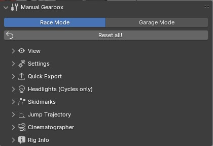
    
    *The Manual Gearbox in the N-Panel* 

.. _rig-setup-mode:
Garage Mode
-----

.. image:: gif/DOC_GarageMode.gif
    :alt: Garage Mode Gif
    :class: with-shadow
    :width: 600px
    :align: center
|

Changing the mode to Garage Mode will get your vehicle ready for new tires, change track width or other model changes.
In the "Garage" all animations will be disabled temporarily and the vehicle is moved to the center of the scene. Blender also enters "Local View", so all other objects will be temporarily hidden until you go to "Race Mode" again.

Body, Wheel, Brake, Headlight and Steering Wheel attachment bones and setup controls for wheel-base length, track-width length, wheel radii, and roll center can be found in this mode. Enter "Pose Mode" and select and move the handles to start adjusting.
You can manually parent meshes, nulls and armatures to the body or wheels. 

.. note::
    The vehicle will temporarily be put into the center of the scene and all animations disabled. All animations will be restored when "Race Mode" is entered again.  

|
*Reset all!*
Will reset all LC properties for the active vehicle to their default value.

|
.. _view:
View
-----

The View Panel has options for what will be shown in the 3D View over and around the Vehicle.

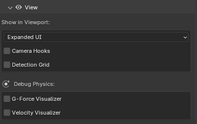
    
    *View Panel in the Manual Gearbox UI* 

|
.. _enable_extra_handles:
Expanded UI
^^^^^^^^
Enables extra :ref:`animation-handles` and Sliders in the 3D view above and around the vehicle.

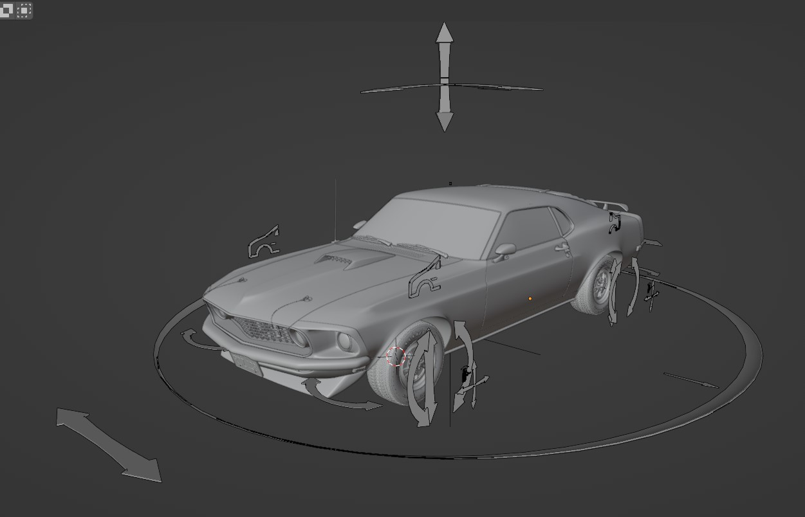
    
    *Add Extra Handles to control more things!* 

|
.. _enable_camera_hooks:
Camera Hooks
^^^^^^^^
Shows two Camera Hooks hovering above the active vehicle. Go into "Pose Mode" to select them and parent your camera to them.
The "Follow Cam" will track the general motion of the vehicle without taking the suspension into account, while the "Mounted Cam" will be attached to the body of the vehicle, following its every move

Alternatively, you can create hooked cameras with 1 Click in the :ref:`cameras` section.

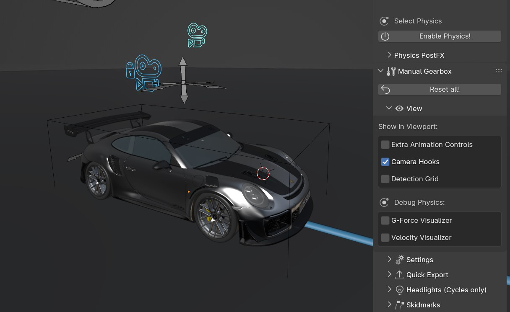
    
    *Attach your 3D Cams here* 

|
.. _enable_grid_viz:
Detection Grid
^^^^^^^^
Turn the visibility of the :ref:`ground-detection` debug grid ON/OFF.

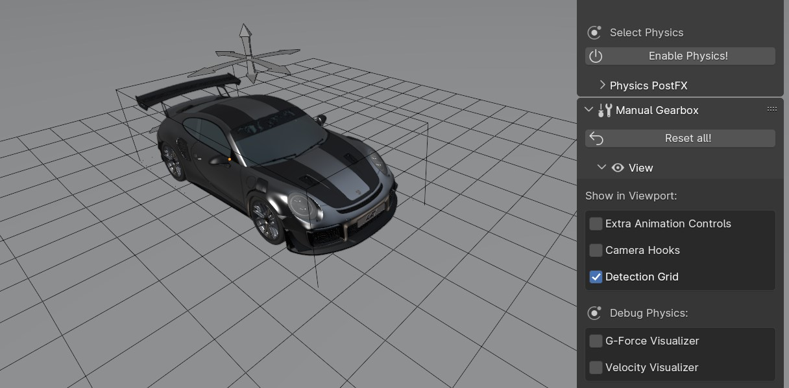
    
    *Useful for Debugging the Ground Detection* 

|
.. _enable_acc_viz:
G-Force Visualizer
^^^^^^^^
Enable an G-Force Visualizer in the viewport to see the force calculated and used by the :ref:`real-time-physics`.

..  figure:: gif/GIF_G-Force.gif
    :alt: Custom Physics
    :class: with-shadow
    :width: 350px
    :align: center

    *The G-Forces which are working on the vehicle*

|
.. _enable_vel_viz:
Velocity Visualizer
^^^^^^^^
Enable a Velocity Visualizer in the viewport to see the velocity calculated and used by the :ref:`real-time-physics`.

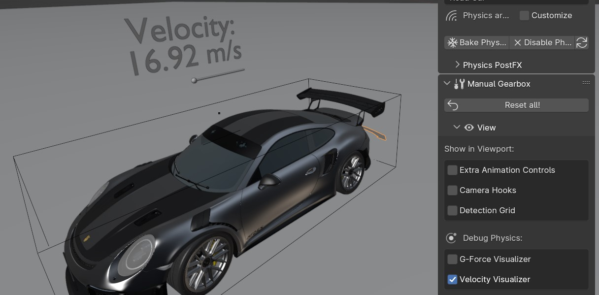
    
    *The Velocity of the vehicle*

|
.. _settings:
Settings
-----

The Settings Panel controls how the :ref:`ground-detection`, :ref:`animation-handles`, Driving Path behave. You can also enter ":ref:`rig-setup-mode` here to adjust the vehicle and add new meshes to it.

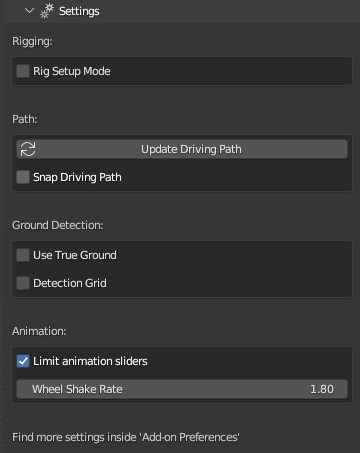
    
    *Settings Panel in the Manual Gearbox UI* 

|
Update Driving Path
^^^^^^^^
See: :ref:`update-driving-path`

.. _snap-driving-path:
Snap Driving Path
^^^^^^^^
Automatically snap the Control Points of the Driving Path to the Ground Detection Meshes.

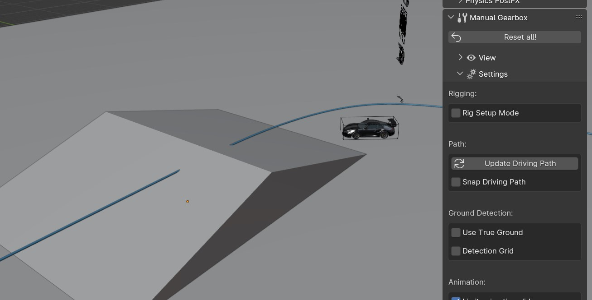

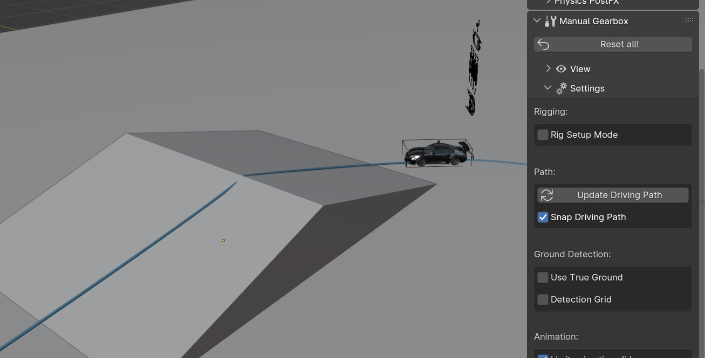

|pic1| |pic2|

*Driving Path Snap OFF and ON. A quick way to match the path to the ground.* 

.. note::
    The threshold for the vehicle detecting the ground is 4 m. If the vehicle is further away than this, it will instead stick to the path.

|
.. _ground-colliders:
Ground Colliders
^^^^^^^^

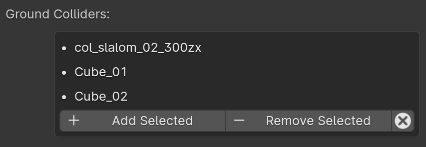
    
    *List of meshes contributing to the Ground Detection* 

Launch Control uses automated :ref:`ground-detection`.
To make any mesh contribute to the ground detection you can either add it to the collection "LaunchControl -> GroundDetection" or simply select it, and hit the "+ Add Selected" button.
To remove a mesh, select it and hit the "- Remove Selected" button. 
The "x" button removes all meshes from the Ground Collders list.

|
.. _detection-grid:
Detection Grid
^^^^^^^^
See: :ref:`enable_grid_viz`

|
.. _detection-resolution:
Resolution
^^^^^^^^
Change the resolution of the detection grid which is projected onto the geometry inside the "Ground Detection" collection.

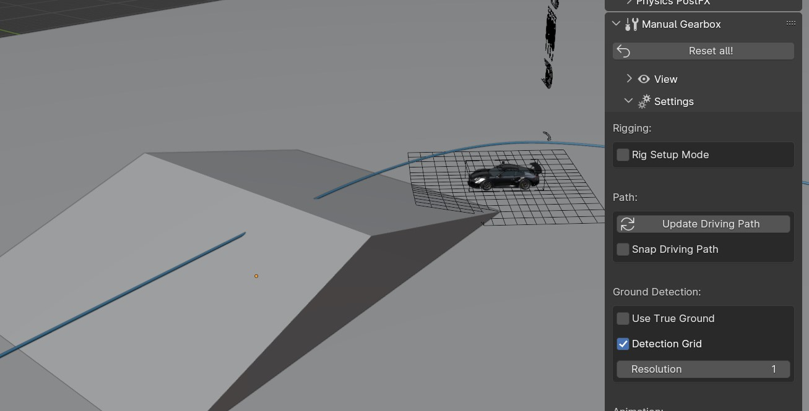

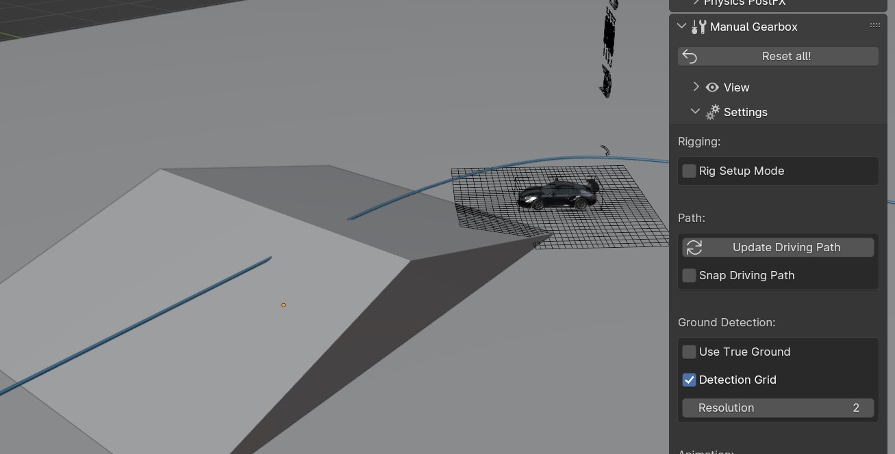

|pic3| |pic4|
    
*Detection Resolution 1 for smooth motion, 2+ for detailed motion* 

|
.. _use-true-ground:
Use True Ground
^^^^^^^^
Use the actual objects inside the collection 'GroundDetection', instead of a projected grid. This can be useful for complex loops or twisting roads built of 1 solid mesh.

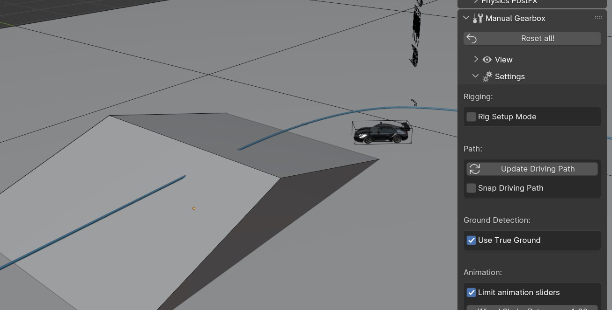
    
    *Use actual meshes for Ground detection* 

.. warning::
    Will generally give a visually worse result and can introduce 'flickering' in the detection on 'layered' surfaces.

|
.. _legacy-ground-detection:
Legacy Ground Detection
^^^^^^^^
By default LC will use an updated model for the ground detection. This model works better with banked surfaces and erratically bumpy surfaces. Disable to get the old ground detection back.

|
.. _limit-sliders:
Limit Animation Sliders
^^^^^^^^
To allow full control all the Viewport UI sliders can be "unlocked" so you can over-crank them and get whatever craziness you want.

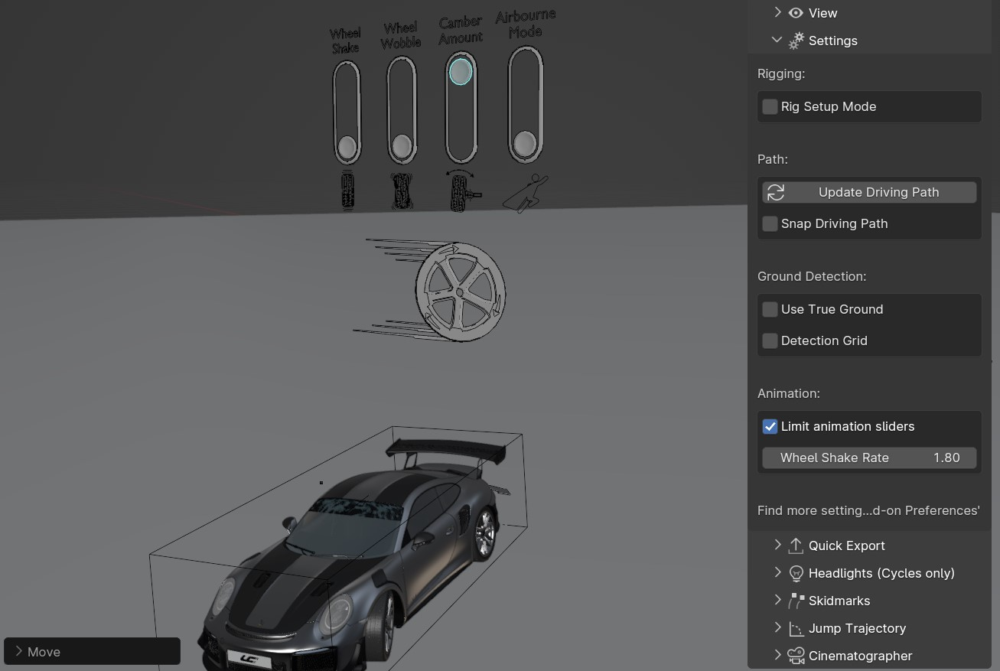
    

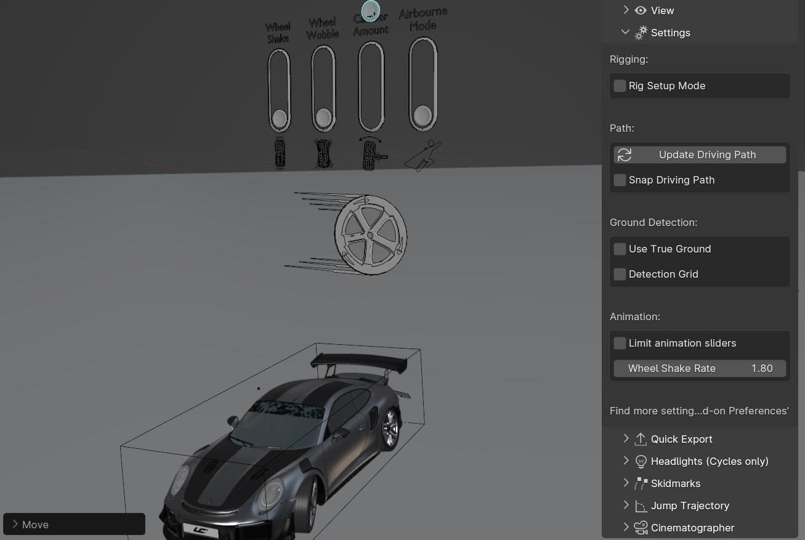

|pic5| |pic6|
    
*Default: Locks the sliders inside the best range, check to unlocks the sliders* 

|
.. _wheel-shake-rate:
Wheel Shake Rate
^^^^^^^^
How fast the wheel shake is. Higher value produces faster shake.

|
.. _quick-export:
Quick Export
------

The Quick Export handles export of the animation to other DCCs such a Unreal Engine, Omniverse, Cinema 4D, Maya, and more. It can also export a baked Blend file for render farms.

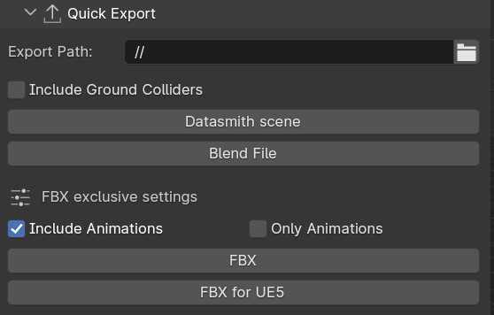
    
    *Quick Export Panel in the Manual Gearbox UI (Datasmith Export is no longer available)* 

Export Path:
    * Set the path as desired. Leaving it blank will export the file as "Launch_Control_Export.FORMAT" relative to the saved .blend file.

Animation Subframes:
    * LC exports the amount of subframes per frame of animation indicated here. The fewer subframes, the faster. Too few subframes can cause reverse-spinning wheels.

FBX Exclusive Settings:

Include Ground Colliders:
    * Includes all the ground detection meshes in each of the exported file.

Include Animations:
    * When checked, LC will export the meshes, the rig and animations. When unchecked, LC will only export the meshes and the rig.

Only Animations:
    * When checked, LC will NOT export the meshes, which results in much faster export speeds. However, it will still export the rig and the animations. 
This is especially useful when importing to Unreal Engine, where the "Only Animation FBX files" will be read as animation assets, which fit a previously exported "skeletal mesh" (an FBX with the meshes and the rig)

.. note::
    "Rebase bones" are exported with the rig, which can be used inside UE5 to bind static meshes to the exported LC rig.

.. warning::
    UE 5.4 seems to import the FBX animation with jitter. The visual impact is small, but visible. Please stick to UE 5.3 if possible. We are working on a solution.

|
.. _headlights:
Headlights
-----

The Headlights Panel help you quickly adjust and render Headlight Beams in front of the vehicle

.. note::
  Only Beams are set up here, not any emitting lamps or meshes inside the headlight geometry.

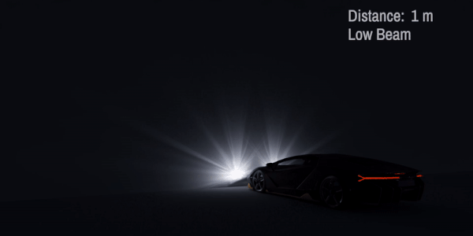

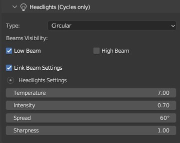

|pic7| |pic8|
    
*Headlights Panel in the Manual Gearbox UI* 

Headlights will automatically be rigged if detected in the model. If not, you can manually parent them to the "body" of the vehicle.

Different texture presets can be picked for the light beam. Low Beam and High Beam can be toggled and more settings can be dialed in.

|
.. _skidmarks:
Skidmarks
-----

The Skidmarks Panel helps you generate skidmarks from the tires of the vehicle.

.. note::
  Skidmarks currently only support pressure to calculate the intensity. Wheel-spin or Wheel-locking does not currently affect the generated Skidmarks

..  |pic9| image:: gif/GIF_Skidmarks.gif
    :alt: Skidmarks
    :class: with-shadow
    :width: 48%

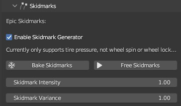

|pic9| |pic10|
    
*Skidmarks Panel in the Manual Gearbox UI* 

|
.. _jump-trajectories:
Jump Trajectory
-----

With the Jump Trajectory Panel, you can generate a realistic jump path for your vehicle.

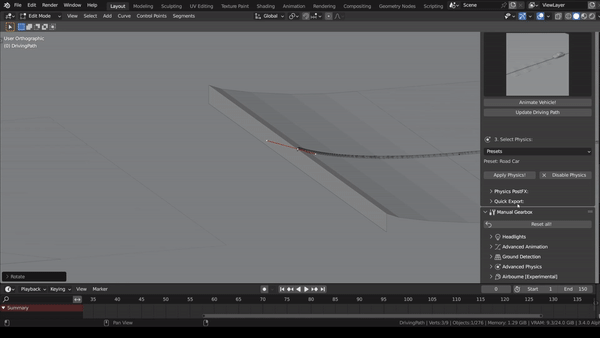

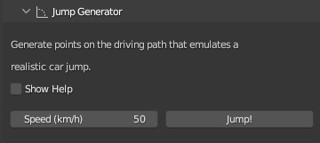

|pic11| |pic12|
    
*Jump Trajectory Panel in the Manual Gearbox UI* 

Calculates spline-points of a realistic car jump depending on the input speed. 

To use it, go into edit-mode on the "DrivingPath" and select the last point, which has to be the very end of the "ramp" the car is going to jump from. This last point needs to have a handle. The angle of the handle will be the take-off angle and the "Jump Speed" (Speed of the car at take-off point) must be defined in the Add-on UI. If you prefer Imperial Units, you can check the check-box in the Add-on UI. The calculation will always expect the end of the jump is on Z=0. 

|
.. _cameras:
Cinematographer
-----

The Cinematographer Panel will help you quickly set up Cameras for your Animation.

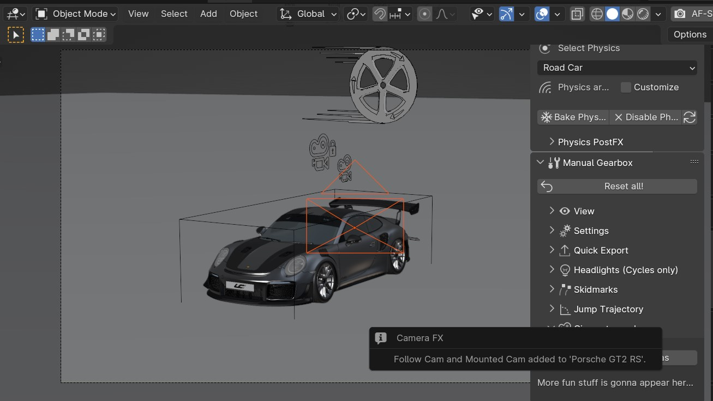

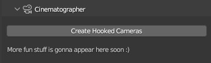

|pic13| |pic14|

*Cinematographer Panel in the Manual Gearbox UI* 

Click the "Create Hooked Cameras" to generate two cameras from the 3D view hooked to the active vehicle.
The "Follow Cam" will track the general motion of the vehicle without taking the suspension into account, while the "Mounted Cam" will be attached to the body of the vehicle, following its every move

|
.. _rig-info:
Rig Info
-----

The Rig Info Panel will show you if the rigged vehicle which is currently active is compatible with the version of the Launch Control Addon you have installed.

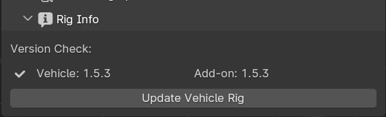
    
    *Rig Info Panel in the Manual Gearbox UI* 

You can also "Update Vehicle Rig" to automatically unrig your 1.5+ vehicle and rig it with the rig armature that matches the installed version of LC. 
In the process, LC will store the animtion data, driving path, ground detection, all the physics settings and rig setup settings and apply them after the re-rigging is done. 
Depending on the versions some data might not be possible to apply, so expect loss of data if you are updating an old file.

If you have a file with a "Legacy Rig" (Rigged in LC 1.0-1.3), you can try to "Update Vehicle Rig" too, but the successrate will be lower.

If a new version of the Launch Control Add-on is available, a box will pop up here notifying you about this. You can either pick to "Ignore" and not get this notification anymore, or head "To Download Page" to update your version of the add-on. Make sure you are logged into the selected download page and that you picked the right page inside the Add-on Preferences for Launch Control.