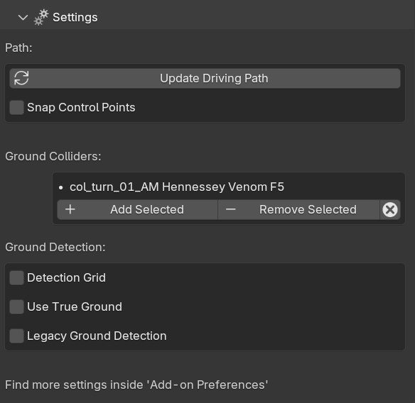

Manual Gearbox
===================================

Inside the Manual Gearbox you have a wide range of customization options to make LC work better for you. This is also where you can reveal advanced sliders and handles in the Add-on UI and 3D viewport.

    
    *The Manual Gearbox in the N-Panel* 

*Reset all!*
Will reset all LC properties for the active vehicle to their default value.

.. _view:
View
-----

The View Panel has options for what will be shown in the 3D View over and around the Vehicle.

..  figure:: img/IMG_View.jpg
    :alt: View
    :class: with-shadow
    :width: 350px
    :align: center
    
    *View Panel in the Manual Gearbox UI* 

.. _enable_extra_handles:
Extra Animation Handles
^^^^^^^^
Enables extra :ref:`animation-handles` and Sliders in the 3D view above and around the vehicle.

.. _enable_camera_hooks:
Camera Hooks
^^^^^^^^
Shows two Camera Hooks hovering above the active vehicle. Go into "Pose Mode" to select them and parent your camera to them.
The "Follow Cam" will track the general motion of the vehicle without taking the suspension into account, while the "Mounted Cam" will be attached to the body of the vehicle, following its every move

Alternatively, you can create hooked cameras with 1 Click in the :ref:`cameras` section.

.. _enable_grid_viz:
Detection Grid
^^^^^^^^
Turn the visibility of the :ref:`ground-detection` debug grid ON/OFF.
When Detection Grid is on, you can change the :ref:`detection-resolution`.

.. _enable_acc_viz:
Acceleration Visualizer
^^^^^^^^
Enable an Acceleration Visualizer in the viewport to see the accelerations calculated and used by the :ref:`real-time-physics`.

.. _enable_vel_viz:
Velocity Visualizer
^^^^^^^^
Enable a Velocity Visualizer in the viewport to see the velocity calculated and used by the :ref:`real-time-physics`.

.. _settings:
Settings
-----

The Settings Panel controls how the :ref:`ground-detection`, :ref:`animation-handles`, Driving Path behave. You can also enter ":ref:`rig-setup-mode` here to adjust the vehicle and add new meshes to it.

    
    *Settings Panel in the Manual Gearbox UI* 

.. _rig-setup-mode:
Rig Setup Mode
^^^^^^^^
Enter a Setup Mode for the Active Vehicle where the sizes of the rig can be adjusted, new body parts added and the Roll Center adjusted.

    
    *Rig Setup Mode controls in the 3D View* 

Body, Wheel, Brake, Headlight and Steering Wheel attachment bones and setup controls for wheel-base length, track-width length, wheel radii, and roll center can be found in this mode. Enter "Pose Mode" and select and move the handles to start adjusting.
You can manually parent meshes, nulls and armatures to the body or wheels. 

.. note::
    The vehicle will temporarily be put into the center of the scene and all animations disabled. All animations will be restored when "rig setup mode" is turned back off.

Update Driving Path
^^^^^^^^
See: :ref:`update-driving-path`

.. _snap-driving-path:
Snap Driving Path
^^^^^^^^
Automatically snap the Control Points of the Driving Path to the Ground Detection Meshes.

.. _use-true-ground:
Use True Ground
^^^^^^^^
Use the actual objects inside the collection 'GroundDetection', instead of a projected grid. This can be useful for complex loops or twisting roads built of 1 solid mesh, but will generally give a visually worse result and can introduce 'flickering' detection on 'layered' surfaces.

Detection Grid
^^^^^^^^
See: :ref:`enable_grid_viz`

.. _detection-resolution:
Resolution
^^^^^^^^
Change the resolution of the detection grid which is projected onto the geometry inside the "Ground Detection" collection.

.. _limit-sliders:
Limit Animation Sliders
^^^^^^^^
To allow full control all the Viewport UI sliders can be "unlocked" so you can over-crank them and get whatever craziness you want.

.. _wheel-shake-rate:
Wheel Shake Rate
^^^^^^^^
How fast the body+wheel shake is. Higher value produces faster shake.

.. _quick-export:
Quick Export
------

The Quick Export handles export of the animation to other DCCs such a Unreal Engine, Omniverse, Cinema 4D, Maya, and more.

..  figure:: img/IMG_QuickExport.jpg
    :alt: Quick Export
    :class: with-shadow
    :width: 350px
    :align: center
    
    *Quick Export Panel in the Manual Gearbox UI* 

Export Path:
    * Set the path as desired. Leaving it blank will export the file as "Launch_Control_Export.FORMAT" relative to the saved .blend file.

Include Ground Colliders for Selected Car:
    * Includes all the ground detection meshes in the exported FBX file for the Active Vehicle.

Include Ground Colliders for All Cars:
    * Includes all the ground detection meshes in each of the exported FBX files.

Include Animations:
    * When checked, LC will export the meshes, the rig and animations. When unchecked, LC will only export the meshes and the rig.

Only Animations:
    * When checked, LC will NOT export the meshes, which results in much faster export speeds. However, it will still export the rig and the animations. 
This is especially useful when importing to Unreal Engine, where the "Only Animation FBX files" will be read as animation assets, which fit a previously exported "skeletal mesh" (an FBX with the meshes and the rig)

.. note::
    For Datasmoth Scene Export, the free "Blender Datasmith add-on" is needed: https://github.com/0xafbf/blender-datasmith-export 

.. note::
    "Rebase bones" are exported with the rig, which can be used inside UE5 to bind static meshes to the exported LC rig.

.. _headlights:
Headlights
-----

The Headlights Panel help you quickly adjust and render Headlight Beams in front of the vehicle

.. note::
  Only Beams are set up here, not any emitting lamps or meshes inside the headlight geometry.

..  figure:: img/IMG_Headlights.jpg
    :alt: Headlights
    :class: with-shadow
    :width: 350px
    :align: center
    
    *Headlights Panel in the Manual Gearbox UI* 

Headlights will automatically be rigged if detected in the model. If not, you can manually parent them to the "body" of the vehicle.

Different texture presets can be picked for the light beam. Low Beam and High Beam can be toggled and more settings can be dialed in.

.. _skidmarks:
Skidmarks
-----

The Skidmarks Panel helps you generate skidmarks from the tires of the vehicle.

.. note::
  Skidmarks currently only support pressure to calculate the intensity. Wheel-spin or Wheel-locking does not currently affect the generated Skidmarks

    
    *Skidmarks Panel in the Manual Gearbox UI* 

.. _jump-trajectories:
Jump Trajectory
-----

With the Jump Trajectory Panel, you can generate a realistic jump path for your vehicle.

..  figure:: img/IMG_JumpGenerator.jpg
    :alt: Jump
    :class: with-shadow
    :width: 350px
    :align: center
    
    *Jump Trajectory Panel in the Manual Gearbox UI* 

Calculates spline-points of a realistic car jump depending on the input speed. 

To use it, go into edit-mode on the "DrivingPath" and select the last point, which has to be the very end of the "ramp" the car is going to jump from. This last point needs to have a handle. The angle of the handle will be the take-off angle and the "Jump Speed" (Speed of the car at take-off point) must be defined in the Add-on UI. If you prefer Imperial Units, you can check the check-box in the Add-on UI. The calculation will always expect the end of the jump is on Z=0. 

.. _cameras:
Cinematographer
-----

The Cinematographer Panel will help you quickly set up Cameras for your Animation.

..  figure:: img/IMG_Cam.jpg
    :alt: Cam
    :class: with-shadow
    :width: 350px
    :align: center
    
    *Cinematographer Panel in the Manual Gearbox UI* 

Click the "Create Hooked Cameras" to generate two cameras from the 3D view hooked to the active vehicle.
The "Follow Cam" will track the general motion of the vehicle without taking the suspension into account, while the "Mounted Cam" will be attached to the body of the vehicle, following its every move
