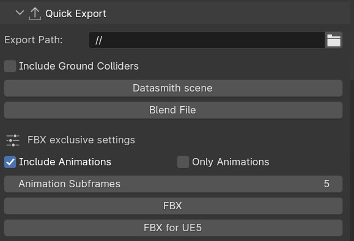

Manual Gearbox
===================================

Inside the Manual Gearbox you have a wide range of customization options to make LC work better for you. This is also where you can reveal advanced sliders and handles in the Add-on UI and 3D viewport.

..  figure:: img/IMG_ManualGearbox.jpg
    :alt: Manual Gearbox UI
    :class: with-shadow
    :width: 350px
    :align: center
    
    *The Manual Gearbox in the N-Panel* 

Reset all button:
Will reset all LC properties for the active vehicle to their default value.

.. _view:
View
-----

The View Panel has options for what will be shown in the 3D Viewport over and around the Vehicle.

..  figure:: img/IMG_View.jpg
    :alt: View
    :class: with-shadow
    :width: 350px
    :align: center
    
    *View Panel in the Manual Gearbox UI* 

.. _enable_extra_handles:
Extra Animation Handles
^^^^^^^^
Enables extra :ref:`animation-handles` and Sliders in the 3D view above and around the vehicle.

.. _enable_camera_hooks:
Camera Hooks
^^^^^^^^
Shows two Camera Hooks hovering above the active vehicle. Go into "Pose Mode" to select them and parent your camera to them.
The "Follow Cam" will track the general motion of the vehicle without taking the suspension into account, while the "Mounted Cam" will be attached to the body of the vehicle, following its every move

.. _settings:
Settings
-----

The Settings Panel controls how the :ref:`ground-detection`, :ref:`animation-handles`, Driving Path behave. You can also enter ":ref:`rig-setup-mode` here to adjust the vehicle and add new meshes to it.

..  figure:: img/IMG_Settings.jpg
    :alt: Settings
    :class: with-shadow
    :width: 350px
    :align: center
    
    *Settings Panel in the Manual Gearbox UI* 

.. _quick-export:
Quick Export
------

The Quick Export handles export of the animation to other DCCs such a Unreal Engine, Omniverse, Cinema 4D, Maya, and more.

    
    *Quick Export Panel in the Manual Gearbox UI* 

.. _headlights:
Headlights
-----

The Headlights Panel help you quickly adjust and render Headlight Beams in front of the vehicle

.. note::
  Only Beams are set up here, not any emitting lamps or meshes inside the headlight geometry.

..  figure:: img/IMG_Headlights.jpg
    :alt: Headlights
    :class: with-shadow
    :width: 350px
    :align: center
    
    *Headlights Panel in the Manual Gearbox UI* 

Headlights will automatically be rigged if detected in the model. If not, you can manually parent them to the "body" of the vehicle.

Different texture presets can be picked for the light beam

Low Beam and High Beam can be toggled and more settings can be dialed in.

.. _skidmarks:
Skidmarks
-----

The Skidmarks Panel helps you generate skidmarks from the tires of the vehicle.

.. note::
  Skidmarks currently only support pressure to calculate the intensity. Wheel-spin or Wheel-locking does not currently affect the generated Skidmarks

..  figure:: img/IMG_Skidmarks.jpg
    :alt: Skidmarks
    :class: with-shadow
    :width: 350px
    :align: center
    
    *Skidmarks Panel in the Manual Gearbox UI* 

.. _jump-trajectories:
Jump Trajectory
-----

With the Jump Trajectory Panel, you can generate a realistic jump path for your vehicle.

..  figure:: img/IMG_JumpGenerator.jpg
    :alt: Jump
    :class: with-shadow
    :width: 350px
    :align: center
    
    *Jump Trajectory Panel in the Manual Gearbox UI* 

.. _cameras:
Cinematographer
-----

The Cinematographer Panel will help you quickly set up Cameras for your Animation.

    
    *Cinematographer Panel in the Manual Gearbox UI* 

Click the "Create Hooked Cameras" to generate two cameras from the 3D view hooked to the active vehicle.
The "Follow Cam" will track the general motion of the vehicle without taking the suspension into account, while the "Mounted Cam" will be attached to the body of the vehicle, following its every move
