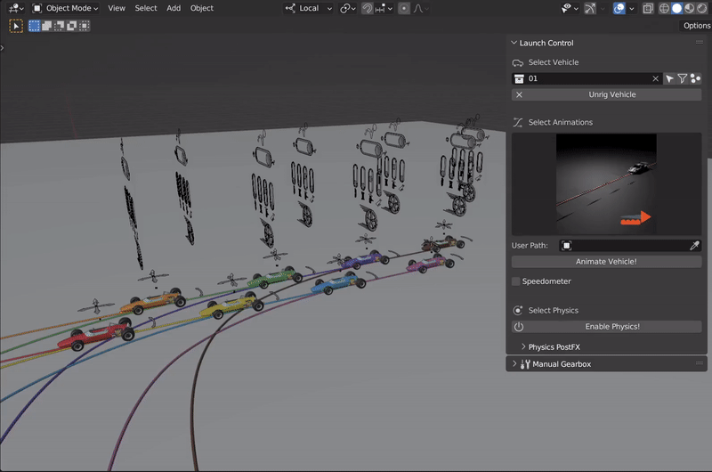
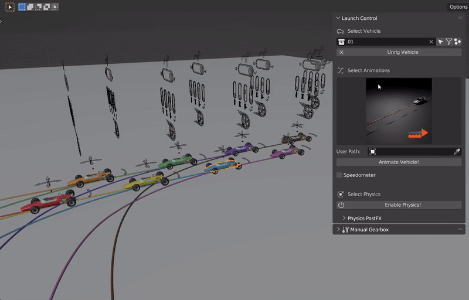

Multi-Car Workflow
===================================
To animate multiple vehicles with Launch Control, the Multi-Car Workflow can be used.

.. _multi-getting-started:
Getting Started with Multi-Car
------

.. figure:: gif/DOC_MultiWork.gif
    :alt: Multi Car Gif
    :class: with-shadow
    :width: 800px
    :align: center

    *Example of working with the Multi-Car Workflow

.. _multi-ground-detection:
Ground Detection for Multi-Car
------
TODO

.. _multi-edit:
Multi-Edit
------

    *Example of using Multi-Edit to adjust multiple vehicles at once

.. _select_active:
Select Active Vehicle
------

    *Using "Select Active" button to change the "Active Car" to the vehicle which is selected in the 3D View

.. _multi-export:
Export with Multi-Car
------
TODO

.. _multi-rigging:
Multi-Rigging [Experimental]
------

.. figure:: gif/DOC_MultiRigging.gif
    :alt: Multi Rig Gif
    :class: with-shadow
    :width: 800px
    :align: center

    *Using "Select Active" button to change the "Active Car" to the vehicle which is selected in the 3D View

To succesfully rig all the cars make sure they all have the required :ref:`rigging-tags`.
