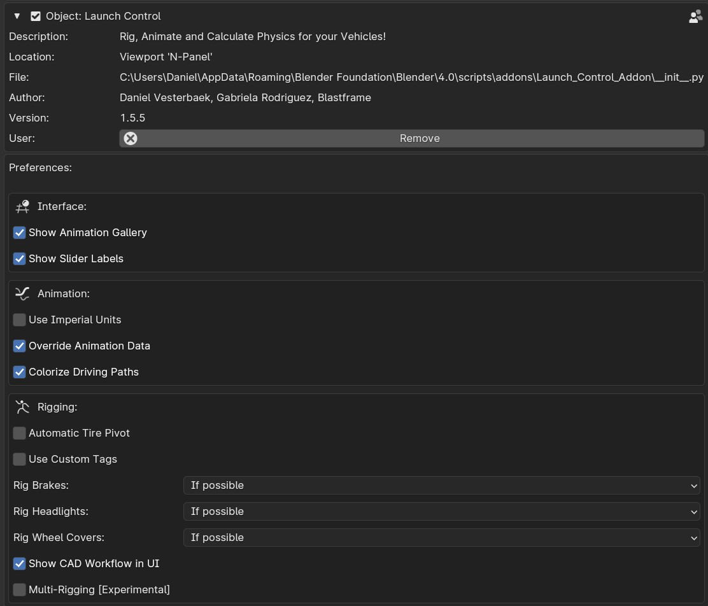

User Preferences
===================================
.. _user-pref:

The Launch Control User Preferences can be used to alter certain behaviour in the Add-on.

    
    *Launch Control Preferences inside Add-ons Preferences* 

Interface
-------------

Show Animation Gallery
  Shows or Hides the Gallery with the preset animations in the Add-on UI.

Show Slider Labels
  Shows or Hides Labels above all the Animation and Setup Sliders above the Vehicle inside the 3D View.

Animation
-------------

.. _use-impertial-units:
Use Imperial Units
  Uses "MPH" instead of "KMH" for the :ref:`speedometer` and the :ref:`jump-trajectories`.

Override Animation Data
  Remove current animation data when a new 'User Path' is picked in the interface and 'Animate Vehicle' is pressed. Animation will be replaced by an automatically calculated offset animation.

Colorize Driving Paths 
  Automatically color the Driving Paths the color of the collection which the corrosponding vehicle exists in when clicking 'Animate Vehicle'

Rigging
-------------
.. _auto-tire-pivot:
Automatic Tire Pivot
  Let LC automatically create new pivots for the tire meshes used for rigging. The new pivots will override any user set pivots. Uncheck to keep user pivots.

.. _custom-tags:
Custom Tags
  Allow the user to define custom search tags that LC will search for when rigging the car.

.. _cad-workflow_toggle:
CAD Workflow in UI
  Reveal a checkbox during the rigging process that optimizes the rigging process for manufactureres data-sets.

Multi-Rigging (Experimental)
  Show the 'Multi-Edit' button when NO VEHICLES are rigged. This specifically allows you to rig all vehicles in your file at the same time. Please do not have any other collections, but collections containing cars inside the file to use this feature.

.. note::
    Remember to "Save Preferences" before exiting. 

Updates
-------------

Inside the Updates section, you can stay updated with the latest version of Launch Control. 

.. _update_platform:
Platform
  Pick the platform you have bought Launch Control from. Make sure you are logged into the platform before going to the clicking any of the "To Download Page" buttons.

.. _update_check_interval:
Uppdate Check Interval
  Enable auto check for updates and set the desired interval here. A notification will appear in the "Rig Info" section of the Launch Control UI and a pop up whenever a new version is found after a check.

.. _update_button:
Check for Updates/Go to Product Page
  Run a check for any updates to Launch Control.

