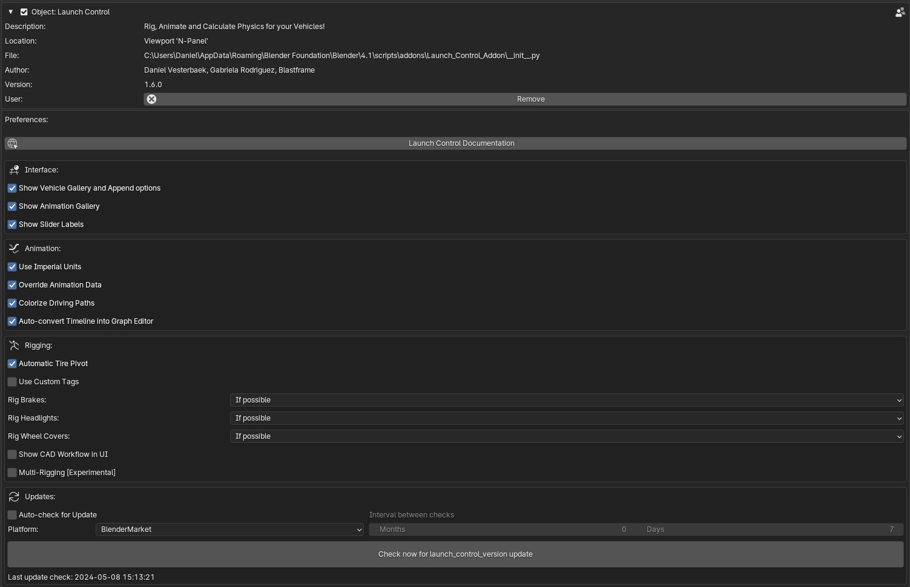

User Preferences
===================================
.. _user-pref:

The Launch Control User Preferences can be used to alter certain behaviour in the Add-on.

    
    *Launch Control Preferences inside Add-ons Preferences* 

Interface
-------------

Show Animation Gallery:
  Shows or Hides the Gallery with the preset animations in the Add-on UI.

Show Slider Labels:
  Shows or Hides Labels above all the Animation and Setup Sliders above the Vehicle inside the 3D View.

Animation
-------------

Use Imperial Units:
  Uses "MPH" instead of "KMH" for the :ref:`speedometer` and the :ref:`jump-trajectories`.

Override Animation Data:
  Remove current animation data when a new 'User Path' is picked in the interface and 'Animate Vehicle' is pressed. Animation will be replaced by an automatically calculated offset animation.

Colorize Driving Paths
  Automatically color the Driving Paths the color of the collection which the corrosponding vehicle exists in when clicking 'Animate Vehicle'

Rigging
-------------
Automatic Tire Pivot:
  Let LC automatically create new pivots for the tire meshes used for rigging. The new pivots will override any user set pivots. Uncheck to keep user pivots.

Use Custom Tags:
  Allow the user to define custom search tags that LC will search for when rigging the car

Multi-Rigging: (Experimental)
  Show the 'Multi-Edit' button when NO VEHICLES are rigged. This specifically allows you to rig all vehicles in your file at the same time. Please do not have any other collections, but collections containing cars inside the file to use this feature.

.. note::
    Remember to "Save Preferences" before exiting. 
